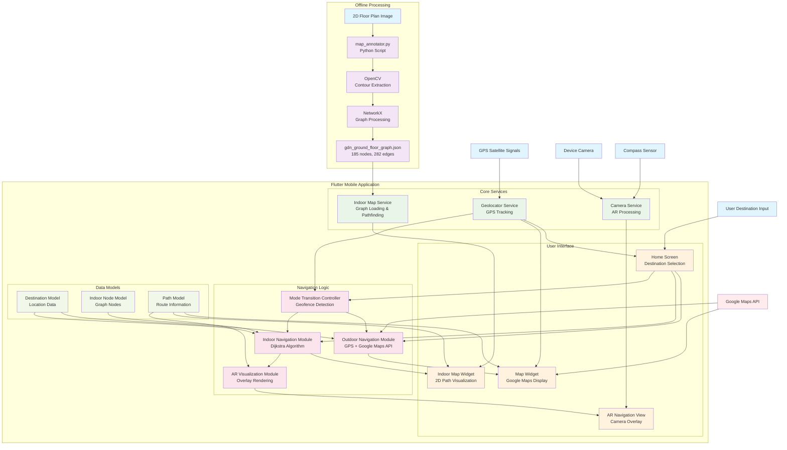
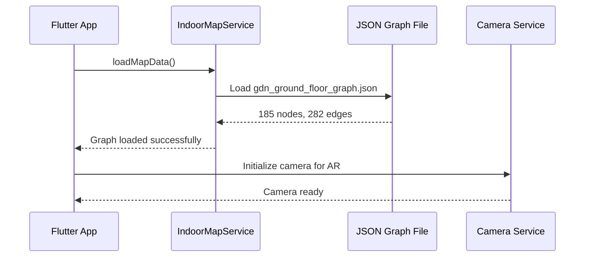
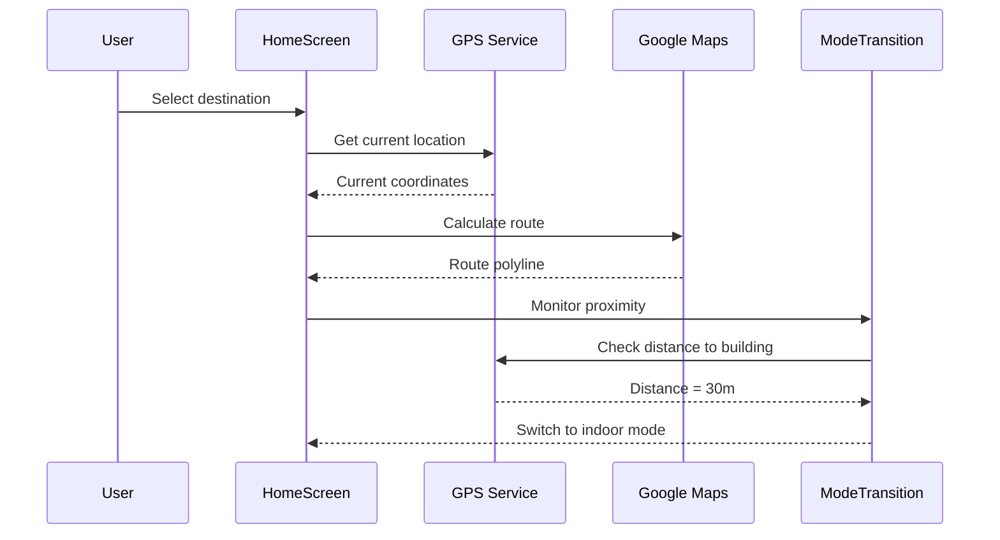
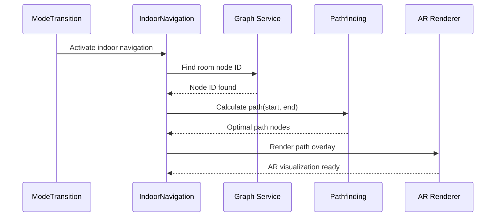

# Pathfinder Indoor Navigation - Data Flow Diagram

## System Architecture & Data Flow



## Detailed Data Flow Process

### 1. **Initialization Phase**


### 2. **Outdoor Navigation Flow**


### 3. **Indoor Navigation Flow**


## Key Data Structures

### Node Structure
```json
{
  "id": 7,
  "x": 594,
  "y": 1047,
  "type": "room",
  "name": "G01"
}
```

### Edge Structure
```json
{
  "source": 6,
  "target": 7,
  "weight": 17.26267650163207
}
```

### Destination Model
```dart
class Destination {
  final String id;
  final String name;
  final LatLng location;
  final String building;
  final bool isIndoor;
}
```

## Performance Metrics

| Component | Data Size | Processing Time |
|-----------|-----------|-----------------|
| JSON Graph Loading | 55.9 KB | 0.004s |
| Dijkstra Pathfinding | 185 nodes | 0.239ms avg |
| Memory Footprint | ~310 KB | Constant |
| AR Rendering Latency | - | 0.15-0.4s |

## Critical Decision Points

1. **Mode Transition**: GPS distance < 25m → Switch to indoor
2. **Path Selection**: Dijkstra algorithm for optimal indoor routing
3. **AR Activation**: User selects AR mode → Camera overlay enabled
4. **Graph Loading**: App startup → Preload indoor graph data

This data flow diagram shows how your hybrid navigation system seamlessly integrates outdoor GPS navigation with indoor graph-based pathfinding, demonstrating the technical sophistication that supports your patent claims.